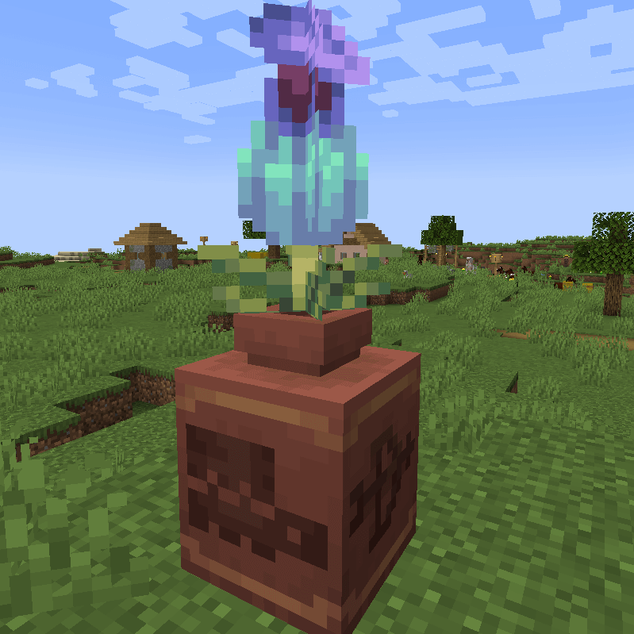

## About

This simple mod lets you plant tall flowers in decorated pots. Usage: place any tall flower like sunflower or pitcher plant on top of the decorated pot. Can be used completely server-sided, but client side is recommended for correct display.
